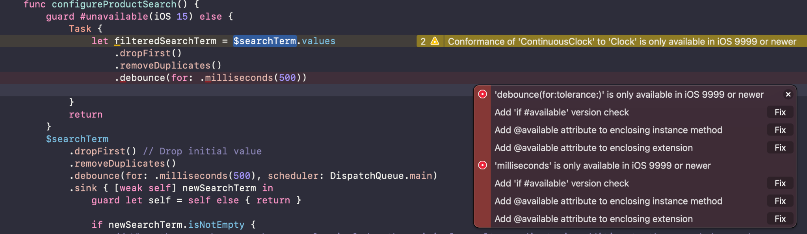

Ever since WWDC 2021, I’ve seen folks getting excited about the introduction of Swift concurrency, a.k.a async/await. It’s very common to come across comments that async/await will soon replace Combine, due to its potential and friendliness.

**TL;DR**: The motivation of this post is to discover the power of [AsyncSequence](https://href.li/?https://developer.apple.com/documentation/Swift/AsyncSequence) when used with [Async Algorithms](https://href.li/?https://github.com/apple/swift-async-algorithms), to see if we can use it in place of Combine. To be more specific, I’m curious to see if we can use it with SwiftUI to handle form validation – one of my favorite applications of Combine when working with SwiftUI.

The short answer is: **Yes!** 🎉

## Bridging from Combine to AsyncSequence

Before getting started, I was thinking that it’s silly to do validation with anything else while we’re already using Combine to work with SwiftUI. Simply put, in WooCommerce iOS, we’ve been using MVVM with SwiftUI, so the views’ states are stored in published variables (`@Published`) in view models. And it makes so much sense to subscribe to those variables to evaluate their values right?

But it has to be possible to bridge from Combine to AsyncSequence. So to be totally honest, I started by googling: “published variable equivalent in async-await” and found that the bridge is pretty simple: since iOS 15, there’s a new instance property for Combine’s Publisher named [`values`](https://href.li/?https://developer.apple.com/documentation/combine/publisher/values-1dm9r), which returns either an [`AsyncPublisher`](https://href.li/?https://developer.apple.com/documentation/combine/asyncpublisher) or an [`AsyncThrowingPublisher`](https://href.li/?https://developer.apple.com/documentation/combine/asyncthrowingpublisher) (depending on whether the stream can throw errors). These types conform to AsyncSequence and there you have it, everything is possible!

## Experiments

If you’re interested, you can join me in my experimental branch: [hackweek/async-algo](https://href.li/?https://github.com/woocommerce/woocommerce-ios/tree/hackweek/async-algo).

One of my favorite publishers in Combine is combineLatest. This is helpful for considering the values of different fields when validating a form. Let’s consider [an example](https://href.li/?https://github.com/woocommerce/woocommerce-ios/blob/8f563ccaaa88547904b9ea571771c88461e96285/WooCommerce/Classes/ViewRelated/Products/Categories/ProductCategoryListViewController.swift#L105-L113):

```Swift
viewModel.$selectedCategories.combineLatest(viewModel.$categoryViewModels)
    .map { [weak self] selectedItems, models -> Bool in
        guard let self = self, self.configuration.clearSelectionEnabled else {
            return true
        }
        return selectedItems.isEmpty || models.isEmpty
    }
    .assign(to: \.isHidden, on: clearSelectionButtonBarView)
    .store(in: &subscriptions)
```

Here `selectedCategories` and `categoryViewModels` are two published variables that we need to evaluate to decide whether to hide a button on the UI. When importing `AsyncAlgorithms`, we can rewrite this in a very similar fashion but with `AsyncSequence`: 

```Swift
Task { @MainActor in
    for await (selectedItems, models) in combineLatest(viewModel.$selectedCategories.values, viewModel.$categoryViewModels.values) {
        guard configuration.clearSelectionEnabled else {
            clearSelectionButtonBarView.isHidden = true
            break
        }
        clearSelectionButtonBarView.isHidden = selectedItems.isEmpty || models.isEmpty
    }
}
```

Since this snippet was added in a synchronous context, I had to use a `Task` to wrap around the logic. One good thing about using the `for` loop is that we can get rid of the `guard let self = self` dance, and we can also migrate away from keeping a variable for subscriptions.

Let’s move on to a [more complicated example](https://href.li/?https://github.com/woocommerce/woocommerce-ios/blob/8f563ccaaa88547904b9ea571771c88461e96285/WooCommerce/Classes/ViewRelated/Orders/Order%20Details/Shipping%20Labels/Create%20Shipping%20Label%20Form/Customs/ShippingLabelCustomsFormInputViewModel.swift#L211-L230). One interesting thing about working with tuples is that there usually is some limit to the number of items grouped together. In RxSwift, `combineLatest` allows up to 8 streams, while in Combine the maximum number of publishers to be combined is 4. `AsyncAlgorithms` allows 3 at the time of writing, but I managed to create subgroups and combine them together:

```Swift
let groupOne = combineLatest($classesAbove2500usd.values, $contentsType.values, $contentExplanation.values)
let groupTwo = combineLatest($itn.values, $itemsValidation.values)
let groupThree = combineLatest($restrictionComments.values, $restrictionType.values)
let validation = combineLatest(groupOne, groupTwo, groupThree)
    .map { [weak self] groupOne, groupTwo, groupThree -> Bool in
        guard let self = self else {
            return false
        }
        let (classesAbove2500usd, contentsType, contentExplanation) = groupOne
        let (itn, itemsValidation) = groupTwo
        let (restrictionComments, restrictionType) = groupThree

        return !self.checkMissingContentExplanation(contentExplanation, with: contentsType) &&
        !self.checkMissingRestrictionComment(restrictionComments, with: restrictionType) &&
        !self.checkMissingITNForDestination(itn) &&
        !self.checkMissingITN(itn, for: classesAbove2500usd) &&
        !self.checkInvalidITN(itn) &&
        itemsValidation.values.first(where: { !$0 }) == nil
    }
    .removeDuplicates()

for await isValid in validation {
    validForm = isValid
}
```

In this case, we can actually `await` on the `combineLatest` of the 3 groups, but I wanted to try out the `map` function on the sequence. Since what we have here is an async sequence, we have to capture `self` and the guard let dance is here again. `removeDuplicates` is another addition from `AsyncAlgorithms` – which is very helpful as well.

One thing to note though – `AsyncAlgorithms` is still a work in progress, so not everything is ready for use yet for now. I tried playing with `debounce` and it seems that it’s not ready yet 😅:



## The verdict

As you can see from my very brief experiments, it is possible to validate forms reactively without Combine if you really need to. I’ll leave you all to judge whether it is worth it – but I’ll subtly insert my opinion here that using Combine is a more straightforward solution when working with SwiftUI. My opinion can however go obsolete if Apple decides to add async/await support for state observation in SwiftUI in the next WWDC 😁.

Async Algorithms, however, is a really promising library if we wish to work with reactive pardigm within the context of Swift concurrency. In other words, we should consider integrating it when migrating away from Combine while keeping the reactive logic in your code. As said earlier, the library is still in beta, so we’ll need to wait until it’s mature enough, unless we want to be adventurous.

## Thoughts?

What do you think about these experiments? Is there anything else I should have covered? Let’s discuss this further if you’re interested 😊

References and further reads:

- [How to use AsyncPublisher to convert @Published to Async / Await | Swift Concurrency #12](https://href.li/?https://www.youtube.com/watch?v=ePPm2ftSVqw&ab_channel=SwiftfulThinking)
- [Bridge from Combine to AsyncSequence – the plan (p. 1)](https://href.li/?https://trycombine.com/posts/combine-async-sequence-1/)
- [AsyncPublisher causes crash in rather simple situation](https://href.li/?https://forums.swift.org/t/asyncpublisher-causes-crash-in-rather-simple-situation/56574)
- [Comparing use cases for async sequences and publishers](https://href.li/?https://www.donnywals.com/comparing-use-cases-for-async-sequences-and-publishers/)
- [Meet Swift Async Algorithms](https://href.li/?https://developer.apple.com/wwdc22/sessions/)