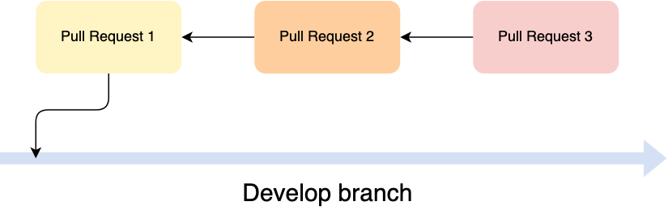

*This post was originally posted in WooCommerce Mobile Project [P2](https://wordpress.com/p2/) page. I figure this can be useful for other fellow developers as well so this is my public version of the post.*

Usually we have several teams working on different features, and we break down tasks into bite-size ones – so large PRs aren’t really a problem. However, for folks working alone on a backlog story, or joining the team for General Maintenance Rotation, and especially Trialmatticians – it’s common to face the issue of handling a big task and having to break them down into smaller parts. So what are the best practices for this situation?

## Feature Branch: Yay or Nay?

In my previous gig, we had around 10 teams working on the same mono-repo project, so we maintained feature branches for each team. My take on this approach:

🎉 Yay: Each team has a separate space to work on their features.
🤦‍♀️ Nay: It can be a pain when merging a long-lived branch, considering potential conflicts in terms of code and features. For example: a team can merge some fix that affects another team and that somehow slips through the crack. When the second team merges their feature, they discover the issue but it may be so close to the deadline and everyone gets panic! 💣💥

So it seems like there are more cons than pros to me.

## Early merges to develop branch

Another solution is breaking down tasks and handling them in separate small PRs, which are merged into develop sequentially. Spoiler alert: this is preferred considering our team size and our strong emphasis on transparency. There are quite a few things to consider though:

- **Careful planning** is highly recommended. When starting with a big task, it is important to separate them into smaller bits. You can start by considering changes you’ll need to make to networking, storage, logic and UI layers. If your task focuses only on the UI layer, you can break it down into even smaller features. This will help with making sure PRs are focused and small, so that it’s easier for your teammate to review.
- Work on **non-user-facing tasks first**. These have less affects on the app when merged, and usually are essential to be merged early to avoid conflicts (take Core Data versioning for example).
- For user-facing changes, if your PR does not complete the feature, **consider a feature flag** to hide the feature from user. At WooCommerce mobile teams we have special tag [status: feature-flag](https://github.com/woocommerce/woocommerce-ios/labels?q=feature-flagged) that can be used to let the team know that a feature is not yet available for testing on release builds.
- Usually a PR can take some time to get merged and you want to work on another to unblock yourself. A good approach is to **create a new PR basing on the previous PR’s branch**. There's a really cool feature of Github that when the base branch is merged to develop, the dependent PR’s base will automatically change to develop!
- It can be a good practice to tag your dependent PRs as `do not merge`, to make sure that they are not accidentally merged before their parent PR. Some may prefer to keep the dependent PRs as drafts instead. I myself prefer the former – just so my teammates can review all PRs as soon as they can (like concurrency in programming 😂).

In the end, if you have a number of pull requests depending on one another, you should have a chain like this:

In my case, I’m not sure if my PRs can get merged before code freeze, so I’m keeping the flag on only for local development (and off for both beta testing and production). You can consider keeping your flag off on local too if it can block other teammates when they need to run the old feature. Just make sure to include instructions to turn the flag on in the testing steps of your PR.

## Final thoughts

In conclusion, I want to highlight the 3 main takeaways of this post:

- Always keep your PRs small and focused.
- It’s important to keep develop branch updated with your changes as early on as possible.
- Feature flags are powerful for developing user-facing features.

I hope this post is helpful for other developers to when working with pull requests. If you have more suggestions for best practices of pull requests, do reach out to me via [Twitter](https://twitter.com/itsmeichigo)!

Until next time 👋