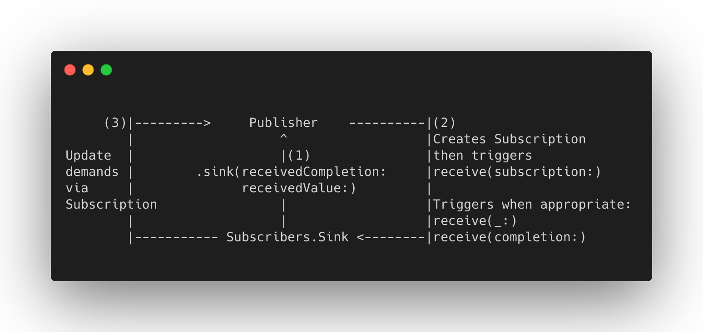

RxSwift has been around since 2015 and widely known among Apple developer community as an efficient open-sourced FRP library. In WWDC 2019 Apple introduced their very own FRP framework, making it possible to utilize the paradigm natively with declarative Swift API. The two frameworks share quite a few similarities in terms of principles and usage, so it can be not too daunting to get your feet wet with Combine if you have already been using RxSwift in your projects.

If you search around the topic, it’s easy to find a [cheatsheet](https://medium.com/gett-engineering/rxswift-to-apples-combine-cheat-sheet-e9ce32b14c5b) for migrating from RxSwift to Combine summed up by [Shai Mishali](https://twitter.com/freak4pc) which is helpful to have a good overview comparision between the two frameworks. In this article I would like to highlight some interesting points about Combine from the viewpoint of a developer who has been working with RxSwift for more than two years.


## Publishers & Subscribers

These two are the equivalents of Observables and Observers in RxSwift. Together they make up the core components of Combine. As Apple put it:

> Combine declares publishers to expose values that can change over time, and subscribers to receive those values from the publishers.

The great thing about using the native FRP framework is that it has been integrated into other Apple’s frameworks, making the migration process easier. Foundation framework has supported the use of Combine in some of its APIs, like `URLSession` in the following example:

```swift
class RepoListViewModel {
    var cancellable: AnyCancellable?
    
    func fetchRepos() {
        let url = URL(string: "https://api.github.com/users/itsmeichigo/repos")!
        cancellable = URLSession.shared.dataTaskPublisher(for: url)
            .sink (receiveCompletion: { completion in
                switch completion {
                case .finished:
                    print("Get repos finished")
                case let .failure(error):
                    print("Get repos failed: \(error)")
                }
            }, receiveValue: { (data, response) in
                print("Got repos data: \(data)")
            })
    }
}
```

In this example, `URLSession` uses `Publisher` as a wrapper to emit signals to its subscribers on receipt of response from the URL request. `.sink` is a method to create a subscription by connecting a subscriber of type `Sink` to a publisher. This method accepts one closure for execution when receiving new elements and another for handling completion. This is similar to RxSwift Observable's `subscribe` method which lets us handle when a stream emits new event, completes or errors out.

Subscriptions in Combine can also be handled by assigning values to class properties that are marked with `@Published` - which is quite similar to `bind(to:)` method in RxSwift Observable:

```swift
struct Repo: Decodable {
    let name: String
    let description: String?
    let language: String?
}

class RepoDetailViewModel {
    @Published var repoDetail: Repo?
        
    func fetchRepoDetail() {
        let url = URL(string: "https://api.github.com/repos/itsmeichigo/Playgrounds")!
        URLSession.shared.dataTaskPublisher(for: url)
            .tryMap(\.data)
            .decode(type: Repo?.self, decoder: JSONDecoder())
            .replaceError(with: nil)
            .assign(to: &$repoDetail)
    }
}
```
Note: In case you’re wondering, since parameter sent to this `assign` method is `inout`, an `&` operator is required to precede `$repoDetail`. The `$` operator is used for accessing the wrapped property itself.

The preceding example uses the property wrapper `@Published` to create a publisher that outputs values of type `Repo?` and has failure type `Never` (meaning the stream never fails - more on that later). The `repoDetail` therefore can be observed for changes by another subscriber:

```swift
class RepoDetailViewController: UIViewController {
    @IBOutlet var titleLabel: UILabel!
    var viewModel: RepoDetailViewModel!
    var cancellable: AnyCancellable?
    
    override func viewDidLoad() {
        super.viewDidLoad()
        cancellable = viewModel.$repoDetail
            .map { $0?.name }
            .assign(to: \.text, on: titleLabel)

		viewModel.fetchRepoDetails()
    }
}
```

As can be noticed from the subscription of `repoDetail`, another method `assign(to:on:)` is used to assign the mapped `name` value to `titleLabel`'s displayed text using KVO. This method keeps strong reference to the object passed to `on:`, so it should be used with caution to avoid retain cycle if you happen to send `self`. Although a quick workaround would be to send `weak self` instead, if you find yourself in such situation, it's time to use an `@Published` property instead (unfortunately `assign(to:)` is only available since iOS 14).


## Subjects

Similar to RxSwift, Combine has the same concept of Subjects — the types of publishers that allow injection of values to be published. Subjects are useful for quickly creating custom publishers and migrating from imperative programming to FRP. There are two built-in subjects:

- `PassthroughSubject`: equivalent to PublishSubject in RxSwift. This subject broadcasts elements to downstream subscribers, suitable for stateless streams of events. This is usually used for observing user interactions (button taps, toggle switches etc.) or sending notifications.
- `CurrentValueSubject`: equivalent to BehaviorSubject in RxSwift. This subject wraps a stream of output of value type and exposes the most recently published element via `value` variable. New values can be injected to the stream by updating the `value` variable or using `send(_:)` method.


## Memory management

If you look closely at the code examples in the first section, you’ll notice the retaining of `AnyCancellable` after creating subscriptions. Methods `.sink` and `.assign(to:on:)` both return `AnyCancellable`, indicating that the subscriptions can be cancelled from outside. This retaining is important to keep the created data streams alive; and also to dispose them when they are no longer relevant - much like how `DisposeBag` is used in RxSwift.

Usually you would want to create more than one subscriptions in a class, so it is more practical to have a set of `AnyCancellable` objects to keep all the subscriptions in one place:

```swift
class RepoDetailViewController: UIViewController {
    @IBOutlet var titleLabel: UILabel!
    @IBOutlet var descriptionLabel: UILabel!
    var viewModel: RepoDetailViewModel!
    var cancellables: Set<AnyCancellable> = []
    
    override func viewDidLoad() {
        super.viewDidLoad()
        viewModel.$repoDetail
            .map { $0?.name }
            .assign(to: \.text, on: titleLabel)
            .store(in: &cancellables)
        
        viewModel.$repoDetail
            .map { $0?.description }
            .assign(to: \.text, on: descriptionLabel)
            .store(in: &cancellables)

		viewModel.fetchRepoDetails()
    }
}
```

Here the lifecycle of `cancellablles` is tied with `RepoDetailViewController`, so when the view controller is released, the subscriptions stored in this property will all be cancelled and disposed as well.

But how about the method `assign(to:)`? Why didn't I retain the subscription made with it like I did with the other two methods?



As you may have guessed, this method links the created subscription with the `@Published` property sent to it, so it does not require the same memory managment machanism as the two methods discussed earlier.


## Type matching and error handling

In RxSwift, Observable is a generic type with an associated type Element defining the type of the data stream’s output. In Combine, a Publisher has two concerns: Output and Failure types. Failure type of a publisher can be either an `Error`-conforming type, or `Never` if it does not publish any error. So when creating a subscription, you have to make sure that the Input type of the subscriber match with the Output type of the publisher. More interestingly, their Failure types are also required to be the same, otherwise you'll encounter a mismatching types error.

Publisher extension has several operators to handle errors. In the `fetchRepoDetail()` example above I used `replaceError(with:)` to silent any decoding or response errors with `nil` since I wanted the failure type of the upstream publisher to match with that of the `@Published` property, which is `Never`. In cases when you are certain that no error should be thrown, `assertNoFailure()` can be used to transform failure type to `Never` or call assert otherwise. You can also use `retry()` to attempt recreating failed subscriptions to a specified number of times; or map the error to another publisher using `catch()`.

In real life situations, however, error handling is more often necessary — here’s how the code can be refactored for that purpose:

```swift
enum RepoError: Error {
    case url(URLError)
    case decode
    case unknown
}

class RepoDetailViewModel {
    let repoDetailSubject = CurrentValueSubject<Repo?, RepoError>(nil)
    
    private var cancellable: Cancellable?
    
    private func fetchRepoDetails() {
        let url = URL(string: "https://api.github.com/repos/itsmeichigo/Playgrounds")!
        cancellable = URLSession.shared.dataTaskPublisher(for: url)
            .tryMap(\.data)
            .decode(type: Repo?.self, decoder: JSONDecoder())
            .mapError { error -> RepoError in
                switch error {
                case is URLError:
                    return .url(error as! URLError)
                case is DecodingError:
                    return .decode
                default:
                    return .unknown
                }
            }
            .sink { [weak self] completion in
                self?.repoDetailSubject.send(completion: completion)
            } receiveValue: { [weak self] repos in
                self?.repoDetailSubject.send(repos)
            }
    }
}
```

In the above solution, I’ve changed the `@Published` property to a `CurrentValueSubject` to change the error type from `Never` to `RepoError`. Then I used `mapError` function to transform the errors from upstream to my custom error type `RepoError`.  The result publisher was finally subscribed using a `Sink` to send values and completion event to the subject. It's a pity that we cannot use `assign(to:)` with a subject like how we can bind observables to subjects or observers in RxSwift - but we can further improve this piece of code in the next section.


## Type eraser

A quick look at the [Apple documentation of Publisher](https://developer.apple.com/documentation/combine/publisher) can show that most operators used on publishers return their respective types extending the `Publishers` enum. Take the code snippet from the previous section as an example, if you paste it in a Playground and open Quick Help panel to investigate the returned types of each operator, you'll be surprised how the types can get more and more complicated after each operator:

- `URLSession.shared.dataTaskPublisher` returns publisher of type `DataTaskPublisher`
- applying `tryMap`, we get the result of type `Publishers.TryMap<URLSession.DataTaskPublisher, T>`
- moving on with `decode`, we get `Publishers.Decode<Publishers.TryMap<URLSession.DataTaskPublisher, Data>, Item, Coder> where Item : Decodable, Coder : TopLevelDecoder, Self.Output == Coder.Input`
- finally, with `mapError` we end up with `Publishers.MapError<Publishers.Decode<Publishers.TryMap<URLSession.DataTaskPublisher, Data>, Repo?, JSONDecoder>, E>`

If we want to expose the publisher to external subscribers, we’ll need a more generic type - `AnyPublisher` - as the subscribers only concern about the output and failure types of the publisher they subscribe to. This is where type erasing comes to play, and Combine has a method for this: `eraseToAnyPublisher()`. Let's see how we can use this to improve the implementation in the previous section:

```swift
func fetchDetail() -> AnyPublisher<Repo, RepoError> {
    let url = URL(string: "https://api.github.com/repos/itsmeichigo/Playgrounds")!
    return URLSession.shared.dataTaskPublisher(for: url)
        .tryMap(\.data)
        .decode(type: Repo.self, decoder: JSONDecoder())
        .mapError { error -> RepoError in
            switch error {
            case is URLError:
                return .url(error as! URLError)
            case is DecodingError:
                return .decode
            default:
                return .unknown
            }
        }
        .eraseToAnyPublisher()
}
```

This time, a publisher is returned immediately from `fetchDetail()` function, and the `RepoDetailViewController` can subscribe directly to it and handle any received events. I can then safely remove redundant use and subscription of `CurrentValueSubject`, and the code looks much neater. The returned publisher is of type `AnyPublisher<Repo?, RepoError>`, which is informative enough for any external subscribers.


## Future and Deferred

In Combine, many publishers invoke their closures and emit values only after they get a subscription. For instance, a `DataTaskPublisher` starts a url request and emit subsequent result whenever it receives demand request from a subscriber. This also means that several subscriptions made to the same publisher can trigger multiple url requests and receive different response - which is not desirable if we just want to observe the same stream. Applying `share()` operator can solve that problem, making sure that the same output of the publisher is shared among its subscribers.

An alternative would be to wrap the `URLSessionDataTask` creation in a `Future`. It's a type of publisher that completes after emitting a **single** output value or failure. This result is republished to any subscriber listens to the same `Future` object. It's suitable for wrapping any asynchronous work that expects only one result. Since a url requests always returns response once and then completes - this is a perfect case for the use of `Future`:

```swift
func fetchDetail() -> Future<Repo, RepoError> {
    let url = URL(string: "https://api.github.com/repos/itsmeichigo/Playgrounds")!
    return Future { promise in
        URLSession.shared.dataTask(with: url) { (data, response, error) in
            if let error = error as? URLError {
                promise(.failure(.url(error)))
            } else if let data = data {
                do {
                    let decoder = JSONDecoder()
                    let detail = try decoder.decode(Repo.self, from: data)
                    promise(.success(detail))
                } catch {
                    promise(.failure(.decode))
                }
            } else {
                promise(.failure(.unknown))
            }
        }.resume()
    }
}
```

Using `Future` requires extra caution though, especially if you apply `eraseToAnyPublisher()` as developers on the receiving end may not be aware of its distinctive features:

- `Future` immediately invokes the asynchronous request in its closure at the time of creation.
- `Future` emits result only once so even though it's still possible to call `retry()` on it, the operator can't create new subscription after the publisher completes.

A solution to delay the start of a `Future`'s work while still taking advantage of its one-time result is to wrap it inside a `Deferred`. This is another special kind of publisher whose job is to wait for a subscription before triggering the supplied closure to create a new publisher. The implementation is simple:

```swift
func createDeferred() -> Deferred<Future<Repo, RepoError>> {
    Deferred {
        Future { promise in
            // The rest of implementation
        }
    }
}
```

With the use of `Deferred`, a new `Future` object is created every time there's a new subscription, making the `Future` lazy - which is more similar to `Single` in RxSwift.


## Backpressure

I cannot end this article without mentioning backpressure. It defines the core principle of Combine: In a subscription, the subscriber controls the handling of events from the upstream publisher, including number of values to be received. As per the documentation on Publisher protocol, the following methods of the subscriber will be triggerred when it listens to a publisher:

- `receive(subscription:)`: Notifies the subscriber of a succesful subscribe request and returns a `Subscription` instance. The subscriber uses this subscription object to request a `Subscriber.Demands` specifying the number items to receive, if any.
- `receive(_:)`: Delivers one element from the publisher to the subscriber. This methods returns another `Subscriber.Demands` to let the publisher know if any more demand for is needed.
- `receive(completion:)`: Informs the subscriber that publishing has ended, either normally or with an error.

The specification of demands makes sure that the subscription sends just enough items as requested by the subscriber and no more. Below is an illustration for a `Sink` subscriber to visualize the relationship and clarify the explanations a little further (apologies for my poor drawing skills 🙂):



Backpressure is an advanced topic and as Apple keeps their implementations of publishers and subscribers private, the complexity of this management is hidden from developers. Understanding the principle of backpressure makes customization for publishers and subscribers possible. One particular use case for this is [CombineCocoa by CombineCommunity](https://github.com/CombineCommunity/CombineCocoa), which makes integration of Combine when using UIControls much more convenient. However, Apple strongly encourages that developers use the built-in convenience publishers and subjects instead of implementing custom ones, so it is important to look for simple solutions before tempting to overengineer to avoid bringing complexity and potential bugs to your projects.


## Epilogue

Since Combine only supports iOS 13 onwards, it may be a bit early for most of current projects to adopt. Nevertheless, it’s never too soon to learn new tech and start experimenting with it to get yourself comfortable and “relevant”. The framework itself is still under development and improvement, so don’t forget to check back in future WWDCs for any cool new updates. I hope this article inspires you to dive deeper and learn more about Combine. I would like to give my thanks to [Donny Wals](https://twitter.com/DonnyWals) for his book [Practical Combine](https://gumroad.com/donnywals#XVbKP), as well as all the resources listed in the References section for making this article possible. In the meantime, you can also check out [RxCombine](https://github.com/CombineCommunity/RxCombine) to discover the possiblities of bridging between the two frameworks. Have fun!


## References

[Apple Developer Documentation](https://developer.apple.com/documentation/combine)

[Getting started with the Combine framework in Swift - SwiftLee](https://www.avanderlee.com/swift/combine/)

[CombineCommunity/rxswift-to-combine-cheatsheet](https://github.com/CombineCommunity/rxswift-to-combine-cheatsheet)

[Using Combine](https://heckj.github.io/swiftui-notes/)

[Understanding Combine](https://www.apeth.com/UnderstandingCombine/)

