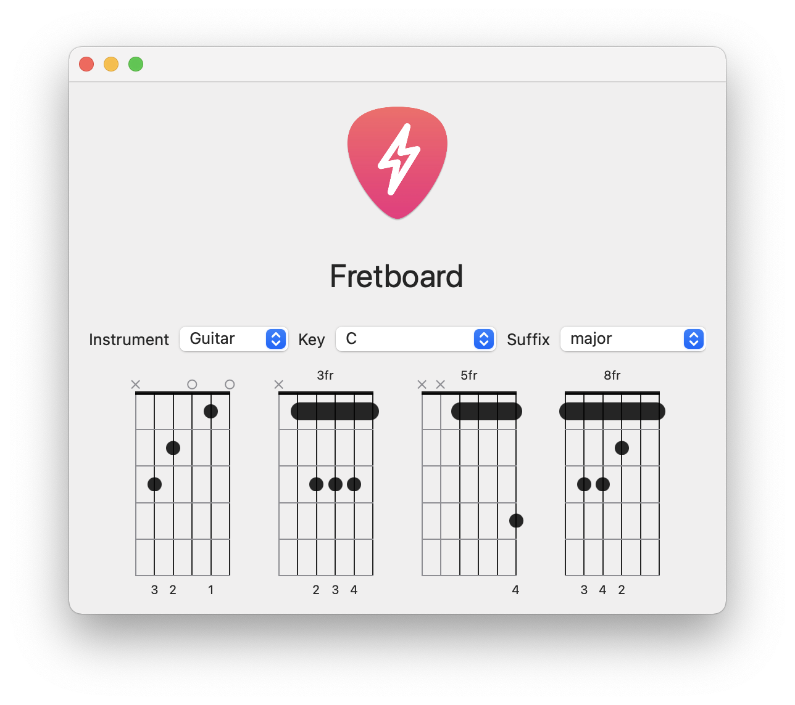

[Fretboard](https://github.com/itsmeichigo/Fretboard) is a weekend project to display guitar and ukulele chords using SwiftUI.

Features:
- 🎵 Chord positions
- 🌗 Light / Dark modes
- 🎸 Guitar & ukulele chords with basic tunings
- ⏳ More to come.

## Installation
#### Swift Package Manager
Add https://github.com/itsmeichigo/Fretboard.git as the source and you're good to go.

#### Manual install 
Copy contents from Sources folder to your project.

## Usage
Get your desired instruments:
```Swift
let guitar = Instrument.guitar
let ukulele = Instrument.ukulele
```

Each instrument comes with their own name, keys, suffixes and chords. Get a list of positions for a chord using key and suffix:
```Swift
let dAug9Positions = guitar.findChordPositions(key: "D", suffix: "aug9")
let cMajorUkuPositions = Instrument.ukulele.findChordPositions(key: "C", suffix: "major")
```

Display any chord by sending it to `FretboardView`:

```Swift
FretboardView(position: dAug9Position)
    .frame(width: 100, height: 200)
```

## Demo app
