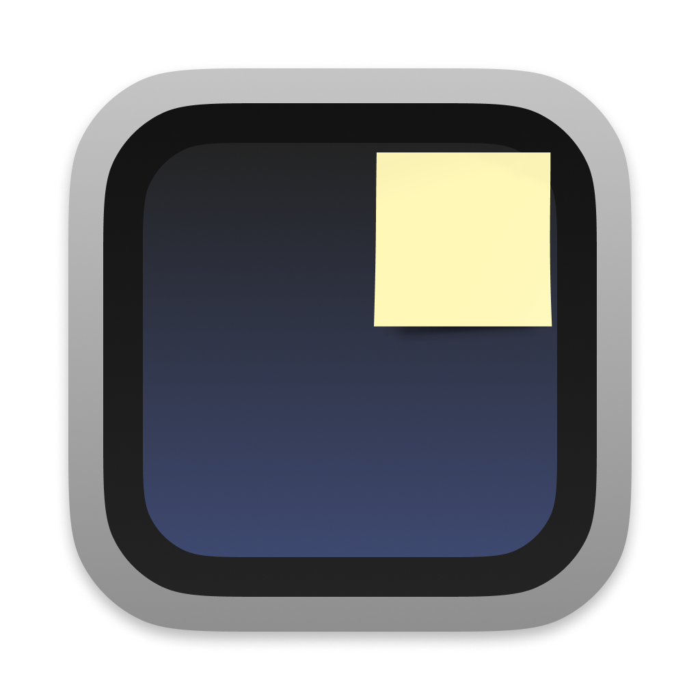
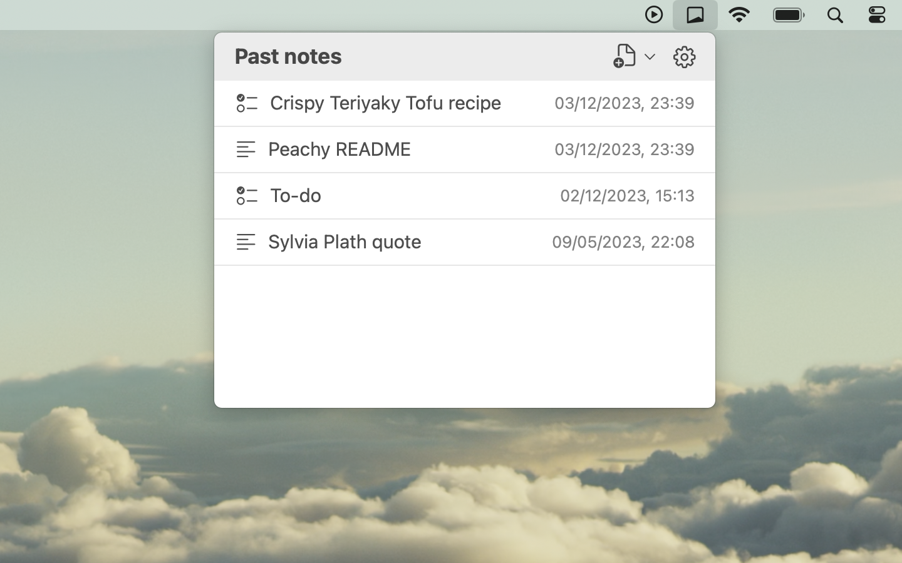
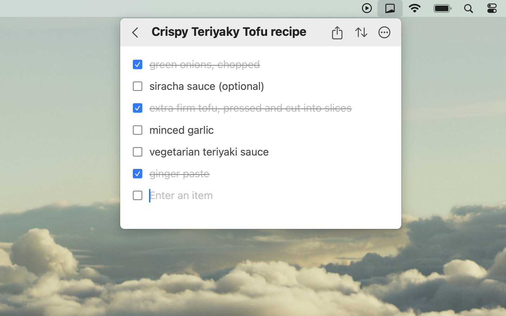
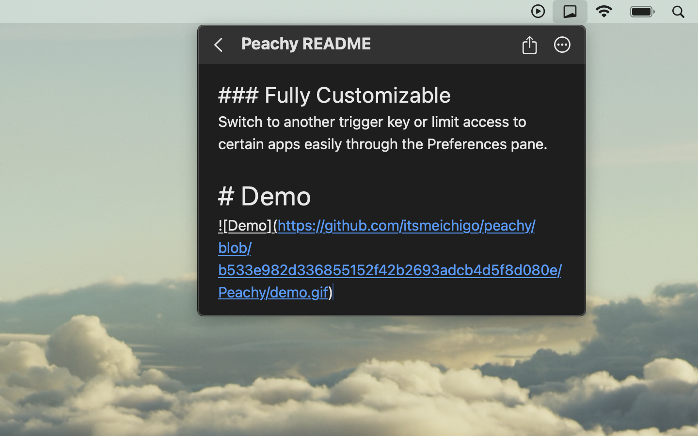
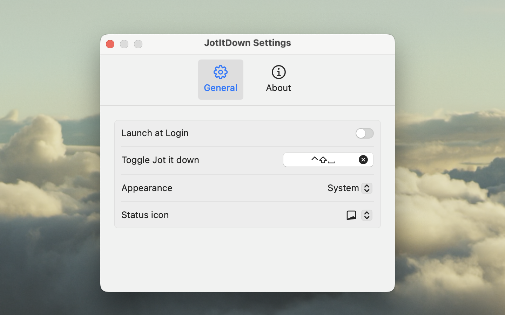

My new app [Jot It Down](https://apps.apple.com/us/app/jot-it-down-minimal-note-app/id1668513911) has been released on the Mac App Store!

Jot It Down is a simple app to quickly note down ideas or checklists.

Highlights:

- No formatting - focus on your contents only. 
- Markdown content is highlighted automatically.
- Window always stays on top.
- Can copy checklist with Markdown format to save somewhere else.
- All notes are auto saved.
- Visit all past notes in the note list.
- Fully private: the app has no access to the Internet.
- Export files to your folders.

This was a small project created during my one week Lunar new year holiday. I always wanted a simple and accessible note app to jot down any quick thoughts and discard them later, and this app serves that purpose. Among thousands of note apps out there, hopefully Jot It Down is helpful for you too.

Some screenshots of the app:

