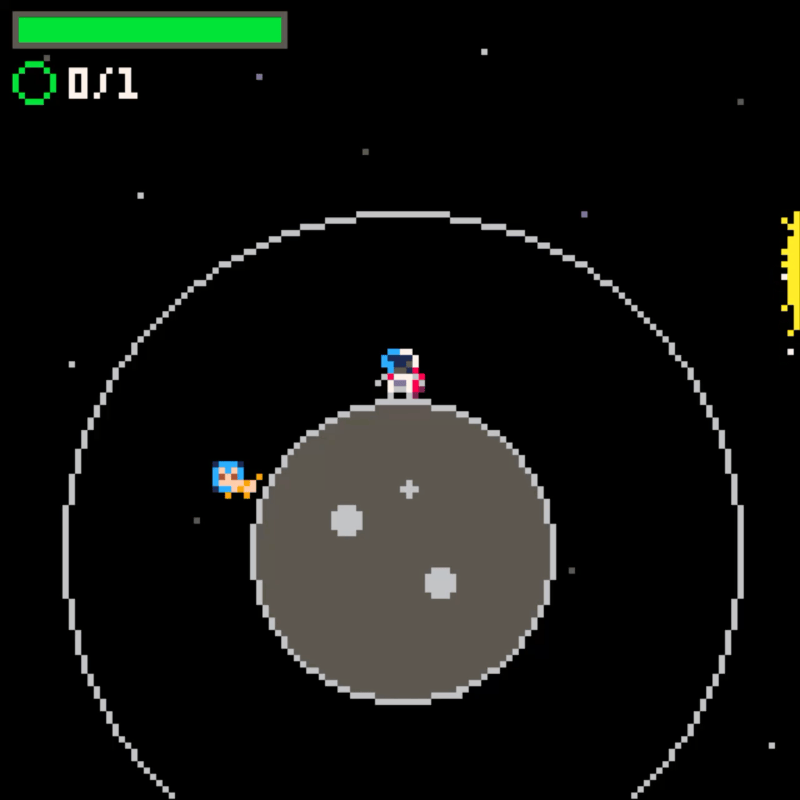

Today I just released my very first Pico-8 game [Last Light](https://www.lexaloffle.com/bbs/?tid=158665)! The game can also be found on [Itch](https://itsmeichigo.itch.io/last-light).

# The backstory

As part of my 3-month sabbatical from my 9-to-5 work, I set out to learn making games. Games always sound more exciting than the usual app making work that I've been doing for the last decade. Games come with much more creative work - you need ideas about story, gameplay, design, sound effects, music. It's so much trickier to finish developing a game when you're just a one-person team.

I made a game in the past, but it was just a simple tapping game. This time I want to remake a puzzle game that I enjoyed but is no longer maintained and has long been removed from the App Store: [Sunburn!](https://aef.itch.io/sunburn).

# Pico-8

It's usually easier to start small, so as a learning experience, I decided to go with [Pico-8](https://www.lexaloffle.com/pico-8.php). I like how it comes with the complete set of tools for making games, with editors for code, sprites, game map, sound effects, and music.

## Project setup

To be honest I'm not a big fan of the native code editor of Pico-8, as it's hard for my eyes to parse the font used there. It's not friend for code reviews either. So the solution for me was to create external Lua files and include them in Pico-8. That lets me use Visual Studio Code and handle source control better.

## Sprite editing

Pixel art is tricky, but it's less so when you draw with lower resolutions. Pico-8 editor uses 8x8 based sprites, so I could focus on more essential details when designing my assets. I also love the limited color pallete, it's perfect for minimal designs. 

## Sound editing

I have no knowledge in music theory, so this was the trickiest part. For the sound effects, it was basically just trials and errors with how I want the effects to be. But music is a different story. This was the part that humbled my creativity the most. I ended up finding royalty-free music in the community to get it over with. For the next games, it would be nice if I get the chance to collaborate with someone who can write music to create original soundtracks.

## Level design

For my puzzle game, each level consists of coordinates for different entities: the planets, crews, obstacles, and the sun (the main goal). I started out with keeping them all in plain text, but that soon became unscalable given the limited 8192 token allowed in a single Pico-8 cartridge. 

The solution was to keep the file out of the cartridge, then write the bits into the `__map__` area of the cartridge. That way I could add almost as many levels as I want. The rest is all up to my creativity to build levels that are intriguring but not impossible to finish.

## Token limit

This needs to be stressed twice. The solution to the level map was not the end of the struggle. I was so used to developing with powerful platforms that I've taken for granted the resources available. With Pico-8, the more logic added the more tokens your game consumes, and 8192 tokens is so small. 

Every time I added a new obstacle to the game, I had to do another round of optimization to reduce the tokens used. This includes limiting one-use constants and helper functions, simpliflying logic, shortening variable names and text contents. This comes with a challenge of ballancing between token optimization and code readability. By the time I finished the first version of the game, I merely reached 7976 over the 8192 token limit.

# Conclusion

Pico-8 is a fun experience for learning to make games with small scopes. I'd love to try with a more serious platform like Unity soon, but it requires so much more time and effort. For now, I'm happy with what I learned, and I'm inspired to make more games in the near future.
