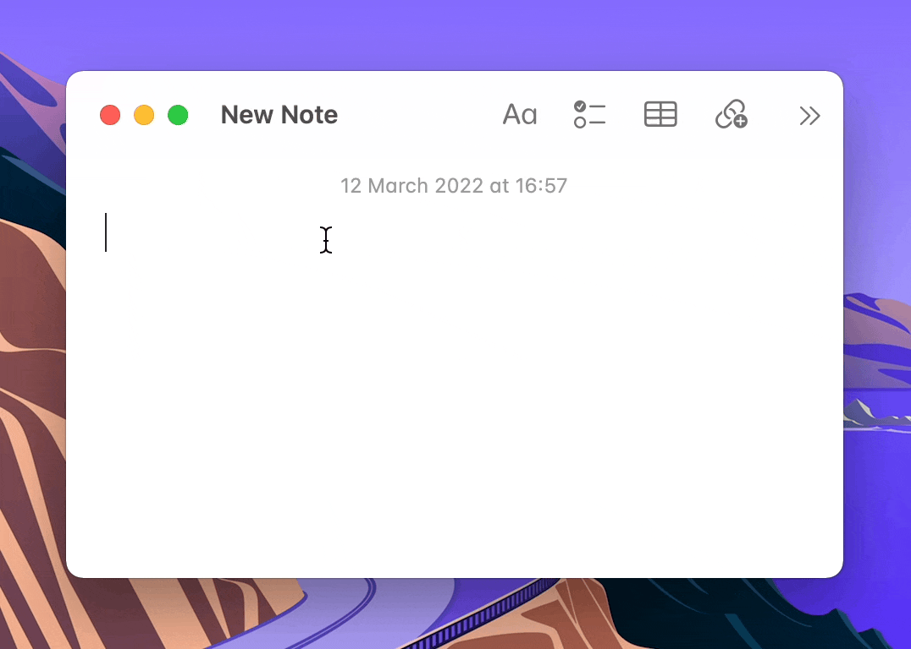

I'm happy to announce that [Peachy](https://itsmeichigo.io/peachy/) is finally out in the wild! 🎉

Peachy is a Mac app for entering Kaomojis easily. This was inspired by [Rocket](https://matthewpalmer.net/rocket/) and suggested/encouraged/challenged by a friend. I took this as an opportunity to get my feet wet with Mac app development, and it was a wholesome experience with a lot of challenges:
- Integration of SwiftUI and AppKit. SwiftUI is nice for creating simple views, but for complex customizations, AppKit is the solution. It was painful, but I did learn a lot.
- Integration of the Accessibility API and learning AppleScript.
- A lot of workarounds!
- Since Accessibility API doesn't work with Sandbox, the app cannot be shipped in the App Store. This came with another bunch of challenges:
  - Creating and notarizing the DMG for the app.
  - Hosting the app manually.
  - Building a landing page to introduce the app.
  - Managing app versions with [Sparkle](https://sparkle-project.org).

More excitedly, Peachy is FREE and [opensource](https://github.com/itsmeichigo/peachy)! If you like Peachy, please feel free to [buy me a cocktail](https://www.buymeacoffee.com/itsmeichigo). Cheers! 🍸