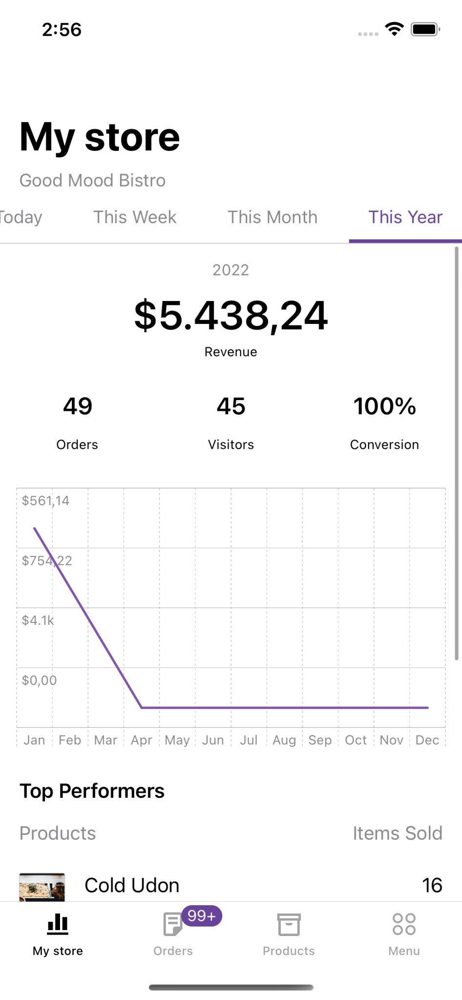

*This post was original posted on [mobile.blog](https://mobile.blog/2022/07/04/an-adventure-with-swift-charts/).*

As you all may already know, one of the cool new things introduced in WWDC 2022 was [Swift Charts](https://developer.apple.com/documentation/Charts), a framework to create charts with SwiftUI. To learn more about the Swift Charts' potential, let's go on a thrilling adventure to replace the chart in [WooCommerce iOS](https://apps.apple.com/us/app/woocommerce/id1389130815) with this ✨✨ shiny new framework ✨✨.

To get started, here's what the chart currently looks like in WooCommerce iOS. We'd want to build something similar using Swift Charts:


## Preparations

The plan is to keep the placeholder in the current view controller where we can add a hosting controller for the new chart (written in SwiftUI) there. We need a new simple `struct` to encapsulate the basic data needed for the chart. The `struct` needs to conform to `Identifiable` just so we can iterate through a collection of this type in SwiftUI.

```Swift
/// A struct for data to be displayed on a Swift chart.
///
struct StoreStatsChartData: Identifiable {
    var id: String { UUID().uuidString }
 
    let date: Date
    let revenue: Double
}
```

## Basic chart

It's time to start the actual work! First, let's create a new SwiftUI view that contains only a single `Chart`. It needs a list of chart data as created above to create a line chart out of it.

In Swift Charts, the contents displaying data are called marks. Different chart types need different marks, for example for a line chart we need [LineMark](https://developer.apple.com/documentation/charts/linemark), and there are others like [AreaMark](https://developer.apple.com/documentation/charts/areamark), [PointMark](https://developer.apple.com/documentation/charts/pointmark), [RectangleMark](https://developer.apple.com/documentation/charts/rectanglemark), [RuleMark](https://developer.apple.com/documentation/charts/rulemark) and [BarMark](https://developer.apple.com/documentation/charts/barmark). Since the chart in WooCommerce iOS has both a line and some gradient beneath it, we can use a combination of a `LineMark` and `AreaMark`:

```Swift
/// Chart for store stats build with Swift Charts.
///
@available(iOS 16, *)
struct StoreStatsChart: View {
    let intervals: [StoreStatsChartData]
 
    var body: some View {
        Chart(intervals) { item in
            LineMark(x: .value("Date", item.date),
                     y: .value("Revenue", item.revenue))
            .foregroundStyle(Color(Constants.chartLineColor))
 
            AreaMark(x: .value("Date", item.date),
                     y: .value("Revenue", item.revenue))
            .foregroundStyle(.linearGradient(colors: [Color(Constants.chartGradientTopColor), Color(Constants.chartGradientBottomColor)],
                                             startPoint: .top,
                                             endPoint: .bottom))
        }
    }
}
```

The result looks good with such minimal configuration:


## Customizations

The new chart displays correct data but doesn't look quite close to what we want to build. Fortunately, it's not complicated to customize charts with Swift Charts. The hardest part for me was navigating through the framework API when the majority of the documentation is missing! Good thing the [WWDC video](https://developer.apple.com/videos/play/wwdc2022/10137) got me through most of it.

### Annotations

Now let's display a text over the chart that says "No revenue this period" when there's no data to show. The text should display on top and at the center of a horizontal line for revenue zero. This can be handled by adding a `RuleMark` for the horizontal line at position zero for y, and then adding a `Text` as annotation for the mark:

```Swift
if !hasRevenue {
    RuleMark(y: .value("Zero revenue", 0))
        .annotation(position: .overlay, alignment: .center) {
            Text("No revenue this period")
                .font(.footnote)
                .padding(Constants.annotationPadding)
                .background(Color(UIColor.systemBackground))
        }
}
```

And we're also hiding the y axis when there's no revenue in a chart. This can be handled with a single line using `chartYAxis` visibility modifier on the Chart:

```Swift
.chartYAxis(hasRevenue ? .visible : .hidden)
```

And the result:


### Axis customizations

The labels on the axes of the new chart didn't match the current chart - the labels were too dense, and the formats weren't right for both the dates and revenues. At first, I came up with a simple solution: since we already had implementations to configure labels for the axes, maybe I can send them to the new chart instead? Here was the result:



This looks so horribly incorrect! The revenues aren't displayed in the correct order, which makes the chart wrong. The reason was probably due to the data for the chart being `String`s, which is a nominal data type, making Swift infers the chart differently from quantitative and temporal types (numbers and dates). I had to revert this change and look for another solution.

After watching the aforementioned WWDC video again, I learned that the axes can be configured with `AxisMarks` through `chartXAxis` and `chartYAxis` view modifiers on the Chart. The `AxisMarks` comes with a constructor that lets us define how to stride the data, and then define the content for each mark, which can be any or all of these: `[AxisTick](https://developer.apple.com/documentation/charts/axistick)`, `[AxisGridLine](https://developer.apple.com/documentation/charts/axisgridline)` and `[AxisValueLabel](https://developer.apple.com/documentation/charts/axisvaluelabel)`.

For the x-axis, I want to display a limited number of dates and format the date to match the correct time range for the current tab. I set the stride for the dates, and then use only a label for each mark to match the current design:

```Swift
.chartXAxis {
    AxisMarks(values: .stride(by: xAxisStride, count: xAxisStrideCount)) { date in
        AxisValueLabel(format: xAxisLabelFormatStyle(for: date.as(Date.self) ?? Date()))
    }
}
```

```Swift
private var xAxisStride: Calendar.Component {
    switch timeRange {
    case .today:
        return .hour
    case .thisWeek, .thisMonth:
        return .day
    case .thisYear:
        return .month
    }
}
 
private var xAxisStrideCount: Int {
    switch timeRange {
    case .today:
        return 5
    case .thisWeek:
        return 1
    case .thisMonth:
        return 5
    case .thisYear:
        return 3
    }
}
 
private func xAxisLabelFormatStyle(for date: Date) -> Date.FormatStyle {
    switch timeRange {
    case .today:
        return .dateTime.hour()
    case .thisWeek, .thisMonth:
        if date == intervals.first?.date {
            return .dateTime.month(.abbreviated).day(.twoDigits)
        }
        return .dateTime.day(.twoDigits)
    case .thisYear:
        return .dateTime.month(.abbreviated)
    }
}
```

For the y-axis, we need to work with `AxisMarks` as well, but the solution is a bit different because the values are numeric. In the current design, we want to display only 3 lines for the y-axis, so I had to calculate the stride such that the data is separated into 2 groups. The labels need to use custom format, so I do that in a helper function and send the formatted content to the `AxisValueLabel` directly. I also want to display the label on the leading edge, so I set it to the position value of `AxisMarks`:

```Swift
.chartYAxis {
    AxisMarks(position: .leading, values: .stride(by: yAxisStride)) { value in
        AxisGridLine()
        AxisValueLabel(yAxisLabel(for: value.as(Double.self) ?? 0))
    }
}
```

```Swift
private var yAxisStride: Double {
    let minValue = intervals.map { $0.revenue }.min() ?? 0
    let maxValue = intervals.map { $0.revenue }.max() ?? 0
    return (minValue + maxValue) / 2
}
 
private func yAxisLabel(for revenue: Double) -> String {
    if revenue == 0.0 {
        // Do not show the "0" label on the Y axis
        return ""
    } else {
        let currencySymbol = ServiceLocator.currencySettings.symbol(from: ServiceLocator.currencySettings.currencyCode)
        return CurrencyFormatter(currencySettings: ServiceLocator.currencySettings)
            .formatCurrency(using: revenue.humanReadableString(shouldHideDecimalsForIntegerAbbreviatedValue: true),
                            currencyPosition: ServiceLocator.currencySettings.currencyPosition,
                            currencySymbol: currencySymbol,
                            isNegative: revenue.sign == .minus)
    }
}
```

And the result looks great:


### Interactions with gestures

One last touch to the new chart that I want to add is the feature to highlight a selected date and its revenue when touching any part of the chart. I want to support both tap and drag gestures, and display a vertical line on the date closest to the touch location, while also sending a callback about the selected interval index to update the parent controller UI.

This can be handled with the `chartOverlay` modifier together with a `GeometryReader` to find the position of the touch location on the screen and determine the value at that position using `ChartProxy`:

```Swift
.chartOverlay { proxy in
    GeometryReader { geometry in
        Rectangle().fill(.clear).contentShape(Rectangle())
            .gesture(DragGesture()
                .onChanged { value in
                    updateSelectedDate(at: value.location,
                                       proxy: proxy,
                                       geometry: geometry)
                }
            )
            .onTapGesture { location in
                updateSelectedDate(at: location,
                                   proxy: proxy,
                                   geometry: geometry)
            }
    }
}
```

```Swift
private func updateSelectedDate(at location: CGPoint, proxy: ChartProxy, geometry: GeometryProxy) {
    let xPosition = location.x - geometry[proxy.plotAreaFrame].origin.x
    guard let date: Date = proxy.value(atX: xPosition) else {
        return
    }
    selectedDate = intervals
        .sorted(by: {
            abs($0.date.timeIntervalSince(date)) < abs($1.date.timeIntervalSince(date))
        })
        .first?.date
    selectedRevenue = intervals.first(where: { $0.date == selectedDate })?.revenue
    if let index = intervals.firstIndex(where: { $0.date == selectedDate }) {
        onIntervalSelected(index)
    }
}
```

Here `selectedDate` and `selectedRevenue` are two `@State` variables that are used to add a `RuleMark` and `PointMark` to the chart:

```Swift
if let selectedDate = selectedDate, hasRevenue {
    RuleMark(x: .value("Selected date", selectedDate))
        .foregroundStyle(Color(Constants.chartHighlightLineColor))
 
    if let selectedRevenue = selectedRevenue {
        PointMark(x: .value("Selected date", selectedDate),
                  y: .value("Selected revenue", selectedRevenue))
        .foregroundStyle(Color(Constants.chartHighlightLineColor))
    }
}
```

And the final result 🎉


## Further improvements

The experiment was pretty successful, but there are still some points in my checklist that weren't covered:

- The `PointMark` in the highlighted view needs to have a border and shadow, but I don't know how to handle that yet. I tried adding those in the Color view of the mark's foreground, but the output was not the expected `ForegroundStyle`.
- The `PointMark` above also doesn't really align with the label on the x-axis - this is another unsolved mystery to me.
- It'd be nice to have some animation when the `Chart` appears. This was not covered in the WWDC video so I will need some more time to figure this out 😅

If you're interested in playing with this experiment, join me on the branch [hackweek/swift-charts-dashboard](https://github.com/woocommerce/woocommerce-ios/tree/hackweek/swift-charts-dashboard).

## Conclusion

I hope you enjoyed this experiment with Swift Charts! We are looking forward to integrating this framework, it was fun to learn how it works and the promising features that it offers. Let me know if you have any questions!

